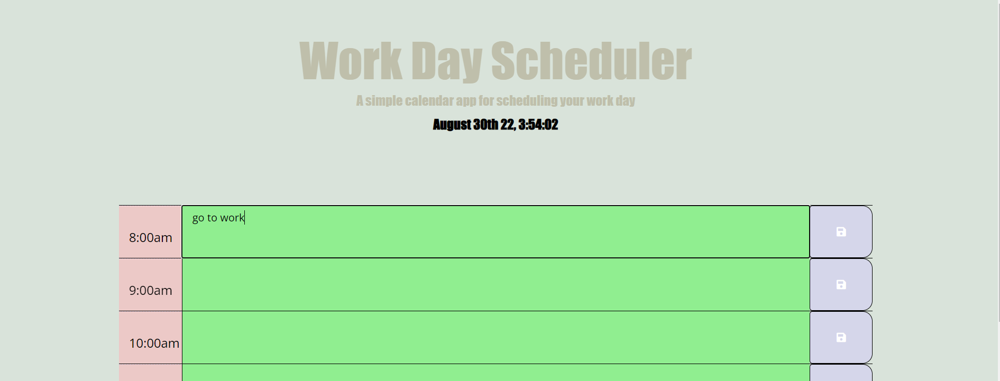

### Goal
-My primary goal for this challenge was to create a functioning work day scheduler using the skills I've learned so far. I had a lot of fun with this activity. This project helped me continue learning and using my skills on JavaScript, Bootstrap, HTML, and CSS. It also helped me discover what skills I need to polish up on. I am still struggling a little with JavaScript and Bootstrap. I feel that I have a firm grasp on HTML and CSS. I really enjoyed playing around with the CSS to make it look more appealing compared to the CSS that was provided to me. 

## Building a Responsive Website

-I was assigned with building a responsive work day scheduler with specific acceptance criteria. This assignment, I was given the majority of the HTML and CSS. I had to make the functioning JavaScript on my own. I had to add the correct links for my CSS, bootstrap, and JavaScript. 

## 
-I watched A LOT of videos on Youtube to help me figure out what my next steps were. I added the correct code to make the Date and time appear underneath the jumbotron. Then, I created ID's and containers to create the boxes inside of HTML so I could call them inside of my JS. After that, I found a unicode for a save button to add to my HTML and CSS so that I could make the button to save whatever is typed inside my boxes in my work day scheduler. Then, I wrote the code to write the hours from my Local Storage. I did hour 1 through hoyr 10. It took me a little while to figure out why the colors of the boxes weren't changing based off the time of day. I realized it's going by army time and not regular time. I had to tweak my code for it to work properly. 

## Demo

View the website at the link below:

MIT License
​
Copyright (c) 2022 Sophia Aramburu 
Permission is hereby granted, free of charge, to any person obtaining a copy
of this software and associated documentation files (the "Software"), to deal
in the Software without restriction, including without limitation the rights
to use, copy, modify, merge, publish, distribute, sublicense, and/or sell
copies of the Software, and to permit persons to whom the Software is
furnished to do so, subject to the following conditions:
​
The above copyright notice and this permission notice shall be included in all
copies or substantial portions of the Software.
​
THE SOFTWARE IS PROVIDED "AS IS", WITHOUT WARRANTY OF ANY KIND, EXPRESS OR
IMPLIED, INCLUDING BUT NOT LIMITED TO THE WARRANTIES OF MERCHANTABILITY,
FITNESS FOR A PARTICULAR PURPOSE AND NONINFRINGEMENT. IN NO EVENT SHALL THE
AUTHORS OR COPYRIGHT HOLDERS BE LIABLE FOR ANY CLAIM, DAMAGES OR OTHER
LIABILITY, WHETHER IN AN ACTION OF CONTRACT, TORT OR OTHERWISE, ARISING FROM,
OUT OF OR IN CONNECTION WITH THE SOFTWARE OR THE USE OR OTHER DEALINGS IN THE
SOFTWARE.
